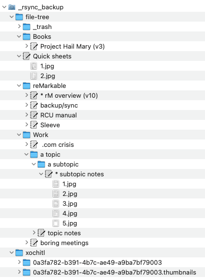

# rMbk2tree
Create viewable folder structure from reMarkable2 backup.

This zsh script reads a local backup that was made of a reMarkable2 e-ink tablet and creates a folder structure (tree) as it would appear on the device. For each notebook there also is a folder, which contains the thumbnail images, for a quick preview.

Example of what it looks like in macOS's Finder:


## Features

- thumbnails are copied and named in page order (1.jpg, 2.jpg etc.)
- trashed files go to a _trash directory

optional:
- favorites are prefixed with "* "
- version numbers of cloud-synced files are suffixed, e.g. "(v10)"
- files with sync status _deleted_ are suffixed " (deleted)"
- macOS only: notebook folders get a nice icon to separate them from folder folders  

## Why?

Some of us have backups of the rM devices' raw data files on their desktop or own cloud. Also if you use the rM desktop app you do have such a backup 
- on the Mac it's in `~/Library/Application Support/remarkable/dektop`
- on Windows it's `%APPDATA%\remarkable\desktop`

Unfortunately looking at these raw files is useless if you want to know what the content of the backup is.

## Usage

The script has no command-line options. 

On a Mac it can be simply double-clicked to run, because it has the extension `.command`

Other platforms may require the extension `.sh` and maybe a `chmod u+x rMbk2tree.sh` to make it executable.

### Set folder paths

Required - change these in the script:

- set _srcDir_ to the path to where your reMarkable backup is
- set _tgtDir_ to the path to where the file tree should go to
```
srcDir=~/Documents/reMarkable/_rsync_backup/xochitl
tgtDir=~/Documents/reMarkable/_rsync_backup/file-tree
```

### Enable options

To activate an option set it to `=1`. Example:  
```
addDeletedState=1
addVersion=
addIcon=1
```
This configuration shows deleted state, no version number and sets a macOS icon for notebooks.

### Mac notebook icon

If option `addIcon=1`, the scripts needs a macOS folder icon as `Icon.rsrc` file. Let's say you have a folder with an icon you like, e.g.
`~/Documents/reMarkable/_Icons/notebook` 
You can get this folder's icon by executing
```shell
cd ~/Documents/reMarkable/_Icons/notebook
DeRez -only icns ./Icon$'\r' > Icon.rsrc
```

Then you set this directory in the script by editing this line:
```
iconDir=~/Documents/reMarkable/_Icons/notebook
```
